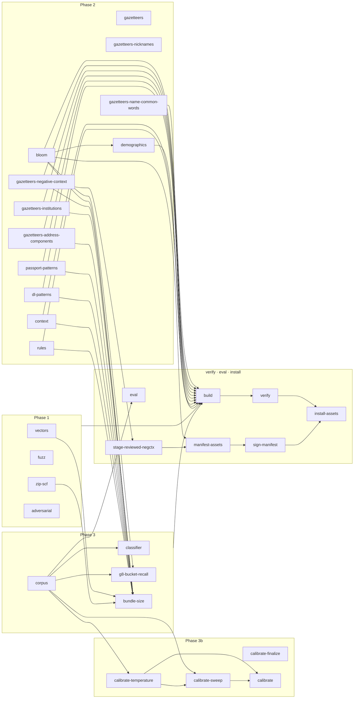

# Resecta Data Pipeline

[](https://github.com/Merlin1A/resecta-datapipeline/actions/workflows/ci.yml)
[](https://github.com/Merlin1A/resecta-datapipeline/actions/workflows/verify.yml)

Build-time Python tooling that produces the data assets shipped inside the Resecta iOS app — name Bloom filters, gazetteers, classifier keyword dictionaries, test corpora, and CI fixtures.

This repository is independent of the Xcode project. Nothing here is linked into the iOS binary; the pipeline's only coupling to the app is the `make install-assets` step that copies generated files into `../resecta/Packages/RedactionEngine/Sources/RedactionEngine/Resources/` (the sibling `resecta` iOS repository).

**Contributor workflow and invariants are in [`CONTRIBUTING.md`](./CONTRIBUTING.md). Read that before making changes.**

---

## Quickstart

```
# One-time setup
scripts/bootstrap.sh

# Build everything
make all

# Build and verify without copying into the Swift tree
make build verify

# Copy built artifacts into the engine Resources path
make install-assets

# Clean build outputs (leaves raw sources alone)
make clean
```

Python 3.12 is required. The bootstrap script creates a local venv at `.venv/`, installs pinned dependencies from `requirements.lock` and `requirements-dev.lock`, and installs this package in editable mode. On macOS, install GNU Make 4.x (`brew install make`) and invoke targets as `gmake` — stock `/usr/bin/make` (3.81) cannot run the `verify` recipe.

---

## Layout

```
resecta-datapipeline/
├── Makefile                 every build target (`make help` lists them; the block below is generated from it)
├── pyproject.toml           pinned dependencies, tool configs
├── requirements.lock        pip-compile output, runtime dependencies
├── requirements-dev.lock    pip-compile output, dev tools
├── uv.lock                  the uv resolver's lock
├── asset_hashes.lock        sha256 of every generated artifact
├── SOURCES.md               every raw dataset: license, URL, retrieval date, SHA-256
├── NOTICE.txt               hand-maintained license aggregate bundled into the iOS app
├── CHANGELOG.md             release notes
├── CONTRIBUTING.md          workflow, invariants, the changes that need a written plan, source hygiene
├── CODE_OF_CONDUCT.md       community standards
├── SECURITY.md              vulnerability disclosure
├── LICENSE                  the license text
├── .github/                 dependabot config; workflows ci (the PR gate), verify (weekly full verify), security (dependency audit)
├── schemas/                 JSON Schema for every output file
├── scripts/
│   ├── bootstrap.sh         first-time setup
│   ├── freeze_deps.sh       regenerate both lockfiles
│   ├── ci_verify.sh         local verify mirror (lint / type / test / build)
│   ├── check_no_pii.py      pre-public guard against personal e-mail addresses
│   ├── hygiene_gate.py      planning-identifier gate (allowlist: hygiene_allowlist.txt)
│   ├── etl_graph.py         regenerates the README stage map from the make database
│   ├── readme_targets.py    regenerates the README targets block from `make help`
│   ├── fetch_*.sh           per-dataset fetchers behind `make sources` (Linux; see CONTRIBUTING)
│   ├── shard_paranames.py   pre-shards the ParaNames corpus for parallel ingest (+ write_shard_meta.py)
│   └── …                    _fetch_lib.sh, reap_orphan_workers.py, reinstall_signatures.sh
├── src/resecta_data/
│   ├── cli.py               click entry points; the INSTALL_ROUTES / SCHEMA_ROUTES tables
│   ├── manifest_signing.py  Ed25519 signing of the shipped gazetteer manifest
│   ├── common/              io, determinism, licensing, mechanism language, stamp keys, exceptions
│   ├── vectors/             structural test vectors per PII family (Phase 1)
│   ├── fuzz/                ReDoS payload generator (Phase 1)
│   ├── adversarial/         adversarial pattern fixtures (Phase 1)
│   ├── bloom/               name Bloom filter builder + manifest (Phase 2)
│   ├── gazetteers/          negative/positive context, institutions, address components, ZIP→SCF, passport / DL patterns, common words, nicknames (Phase 2)
│   ├── context/             raw sources for the positive context keywords (built by gazetteers/context_keywords/) (Phase 2)
│   ├── rules/               PII detector rule-ID catalog (Phase 2)
│   ├── demographics/        demographic coverage report (Phase 2); the G8 bucket-stratified recall artifact (Phase 3)
│   ├── classifier/          doctype keywords, temperature fit, threshold sweep, context scorer (Phase 3)
│   ├── corpus/              G8 synthetic corpus generator + generator profiles (Phase 3)
│   ├── instrumentation/     bundle-size probe (Phase 3)
│   └── eval/                the G8 eval derivations — see eval/README.md
├── tests/                   pytest suite: unit, determinism, schema and Hypothesis property tests
└── build/                   generated artifacts (git-ignored)
```

---

## Makefile targets

The block below is `make help`'s output, generated from the Makefile's own `## ` comments; `make readme-targets` regenerates it and `make lint` fails when it is stale. On macOS invoke every target as `gmake`.

<!-- make-help:begin -->
```text
Resecta DataPipeline — build targets

Primary targets:
  help                 Print this help
  check-python         Verify Python version matches .python-version
  bootstrap            Create venv and install pinned deps
  check-make           Fail with install advice when GNU make is older than 4.0 (the parse-time guard's twin)
  paranames-shards     Pre-shard paranames_full.tsv.gz so `bloom` can parallelize ingest
  build                Generate all artifacts into build/
  build-fast           Alias — `build` is parallel by default now (BUILD_JOBS=N to override; RAM-capped, see BUILD_JOBS)
  time-build           Run each build phase with per-phase wall-time logging
  vectors              [Phase 1] Build NPI/DEA/SSN test vectors
  fuzz                 [Phase 1] Build ReDoS fuzz payloads
  zip-scf              [Phase 1] Build ZIP → SCF → state table (Census ZCTA if present, else HUD bootstrap)
  adversarial          [Phase 1] Build adversarial pattern fixtures
  bloom                [Phase 2] Build name Bloom filters + manifest
  gazetteers           [Phase 2] Build the non-Bloom gazetteers in parallel
  gazetteers-negative-context [Phase 2] Build negative-context candidates
  stage-reviewed-negctx Stage the reviewed negative_context.json into build/ (verifies the candidates-hash sidecar; safe to re-run)
  gazetteers-institutions [Phase 2] Build institutions gazetteer
  gazetteers-address-components [Phase 2] Build address-components gazetteer
  gazetteers-nicknames [Phase 2] Build nickname/diminutive sidecar (needs fetched CC0 source)
  gazetteers-name-common-words [Phase 2] Build the common-word curation sidecar for the surname Bloom filter
  passport-patterns    [Phase 2] Build per-country passport-pattern gazetteer
  dl-patterns          [Phase 2] Build per-state driver-license-pattern gazetteer
  context              [Phase 2] Build per-category positive context-keyword gazetteer
  rules                [Phase 2] Build PII detector rule-ID catalog
  demographics         [Phase 2] Build demographic coverage report
  classifier           [Phase 3] Build doctype keywords, preset-threshold candidates, and the context scorer
  corpus               [Phase 3] Build the G8 synthetic corpus (+ the generator profiles)
  g8-bucket-recall     [Phase 3] Build the G8 bucket-stratified recall artifact
  bundle-size          [Phase 3] Build the bundle-size instrumentation probe
  calibrate-temperature [Phase 3b] Fit doctype-softmax temperature against a Swift dump
  calibrate-sweep      [Phase 3b] Sweep per-category thresholds against a Swift dump (writes the sweep_raw inspection file only)
  calibrate-finalize   [Phase 3b] Promote sweep_raw to the shipping preset_thresholds.json (under an approved change plan: review the diff first)
  calibrate            [Phase 3b] Run both calibration steps (requires Swift-side dumps; finalize is a separate step under an approved change plan)
  sources              Fetch raw inputs (the ONLY network target)
  lint                 Run ruff check + format check, the planning-id gate, and the README block currency checks
  format               Apply ruff formatting
  graph                Regenerate the ETL stage map in README.md from the make database (Mermaid; stdlib)
  readme-targets       Regenerate the Makefile-targets block in README.md from the help output
  typecheck            Run mypy --strict
  test                 Run pytest
  test-fast            Run pytest excluding slow tests
  schema-check-only    Validate the existing build/ artifacts against their schemas (no rebuild)
  schema-check         Validate every build/ artifact against its schema
  determinism-check    Rebuild artifacts and diff (cached via .stamps/.determinism-witness; RESECTA_FORCE_DETERMINISM=1 to bypass)
  determinism-check-force Determinism check with the witness cache bypassed (rebuild and diff every artifact)
  hash-check-only      Verify asset_hashes.lock against the existing build/ (no rebuild)
  hash-check-built-only Verify asset_hashes.lock against what this host built; entries needing fetched sources are skipped
  hash-check           Verify asset_hashes.lock matches current build
  verify               Full verification suite (single build; parallel checks + parallel determinism-check)
  verify-fast          Dev-loop gate: verify WITHOUT determinism-check — not sufficient before install-assets (that keeps full verify)
  eval                 corpus (EVAL_CORPUS_PROFILE) -> both G8 emitters (host swift test, n=2) -> eval-baseline x2 -> eval-sitegap into EVAL_OUT
  manifest-assets      Derive gazetteer_manifest.shipped.json (bloom manifest + every installed asset's digest)
  sign-manifest        Sign gazetteer_manifest.shipped.json with Ed25519 (writes .sig + .pem peers)
  install-assets       Copy artifacts from build/ into the Swift Resources path (verify → stage-reviewed-negctx → manifest-assets → sign-manifest, then copy)
  doctor               Print environment health summary (read-only)
  doctor-orphans       List stale resecta-data worker processes (read-only)
  reap-orphans         Send SIGTERM to detected orphan workers (with confirmation)
  clean                Remove build/ (preserves sources/)
  distclean            Remove build/, .venv/, caches
  all                  Build, verify, and install into Swift tree
  freeze               Regenerate requirements.lock from pyproject.toml
  shell                Launch an interactive Python shell with the package importable

Current phase: 1+2+3 (Phase 3 adds doctype keywords, preset-threshold candidates, G8 corpus).
Phase 3b: 'make calibrate' is out-of-band. It requires Swift-side softmax + detector-score dumps at build/calibration (see schemas/doctype_softmax_dump.schema.json and schemas/detector_score_dump.schema.json).
```
<!-- make-help:end -->

`make all` is equivalent to `make build verify install-assets`. `make eval` is the G8 regression gate — the corpus, the engine's two G8 emitters run on the host, and one derived verdict per site; the contract, the four compare clauses and a checked-in sample verdict are in [`src/resecta_data/eval/README.md`](./src/resecta_data/eval/README.md).

---

## ETL stage map

Generated from the make database by `scripts/etl_graph.py` (`make graph`; `make lint` checks it is current): the phase-tagged build targets and the verify / eval / install chain, with an edge wherever one target's stamp is a prerequisite of another's. A phase whose every stamped target feeds `build` is drawn as one edge; Phase 2 stays expanded because the nicknames gazetteer joins `build` only when its fetched CC0 source is present.

<!-- etl-graph:begin -->

<!-- etl-graph:end -->

---

## The G8 corpus

There is one canonical G8 corpus: 17 PII families over 1,100 synthetic documents (five doctypes × five demographic buckets), built by `make corpus` into `build/corpus/g8_corpus.json` and hashed in `asset_hashes.lock` (the `corpus/g8_corpus.json` row is the digest of record). `make install-assets` copies it into the engine's test fixtures (`Fixtures/corpus/`) through `INSTALL_ROUTES`, so the engine's bundled fixture and the pipeline's build are the same bytes; `make eval` refuses to run when they differ. The generator profiles (`g8-specC`, `g8-specD`, …) re-render the same 1,100 documents along one axis each, for evaluation only, and are never installed.

---

## ParaNames (fetch-on-demand)

The large ParaNames corpus (`paranames_full.tsv.gz`, ~953 MB) is **not committed**, and the repo uses **no Git-LFS**. `scripts/fetch_paranames.sh` downloads it on demand into `src/resecta_data/gazetteers/sources/paranames/` and validates its SHA-256 against `SOURCES.md`. When the full corpus is absent, the Bloom builders degrade to the committed bootstrap sample (`paranames_bootstrap_*.tsv`) so the build still runs; the full corpus is only needed to reproduce the shipped name filters exactly.

> Reproducing the shipped name filters: `gmake verify` hash-checks the built Bloom filters against `asset_hashes.lock`, whose hashes were produced from the full ParaNames corpus. Run `scripts/fetch_paranames.sh` before `gmake verify`. A bare clean-clone `gmake verify` is expected to fail hash-check (bootstrap-only Bloom != full-corpus lock) — this is the no-LFS / fetch-on-demand design, not a regression.

---

## Verification

Every pull request runs a hermetic gate on a hosted runner (`ci.yml`): `ruff check`, `ruff format --check`, `mypy`, `pytest`, the pure-code builders, schema validation, and a hash check of everything built. A weekly `verify.yml` run hydrates the large fetched sources (SHA-256-validated, cached) and runs the full verify sequence, and `security.yml` audits the locked dependency set. Locally, `make verify` (use `gmake` on macOS) remains the gate: it runs `ruff check`, `ruff format --check`, `mypy`, `pytest`, schema validation, hash-lock verification, and a determinism rebuild; `scripts/ci_verify.sh` runs the same sequence as a local smoke check.

---

## Property-based testing

Invariants that hold over a whole input space are tested with [Hypothesis](https://hypothesis.readthedocs.io/) rather than a handful of examples — `@given` over the generator's own domain, `@settings(deadline=None)` because verify runs are CPU-oversubscribed:

- `tests/test_checksums.py` — composing any nine-digit prefix with the computed NPI check digit yields CMS-Luhn remainder 0 and every other check digit breaks it; the DEA check digit is a single digit for every six-digit prefix.
- `tests/test_bloom_ingest_aggregation.py` — the parallel Bloom ingest aggregates any batch of rows to the same key / source / demographic tallies as the serial oracle.
- `tests/vectors/test_npi.py` — any ten-digit candidate is fully valid iff its prefix is 1 or 2 and Luhn passes, end to end through the detector contract.
- `tests/vectors/test_ssn.py` — any (area, group, serial) triple is classified consistently with the six structural rules.
- `tests/vectors/test_routing_number.py` — for every eight-digit prefix the computed ninth digit zeroes the ABA checksum and every other final digit breaks it; every seeded draw of the generator is nine digits with a valid prefix and checksum.
- `tests/vectors/test_credit_card.py` — for every prefix, PAN length and seed the Luhn completion keeps the prefix, has exactly that many digits and passes Luhn, and the flipped-last-digit decoy always fails it.
- `tests/vectors/test_dea.py` — for every seed the DEA catalog is a pure function of the seed, its valid rows close the checksum and its invalid-checksum rows break it.

---

## Licensing

Every dataset under `src/*/sources/` has a row in `SOURCES.md` with its license, retrieval URL, retrieval date, and SHA-256. The bundled `NOTICE.txt` (hand-maintained at the repo root, not generated by `make install-assets`) aggregates these for the iOS app.

See `common/licensing.py`'s `ALLOWLIST`/`GATED`/`FORBIDDEN` sets for the license allowlist and the datasets currently gated on legal review.
