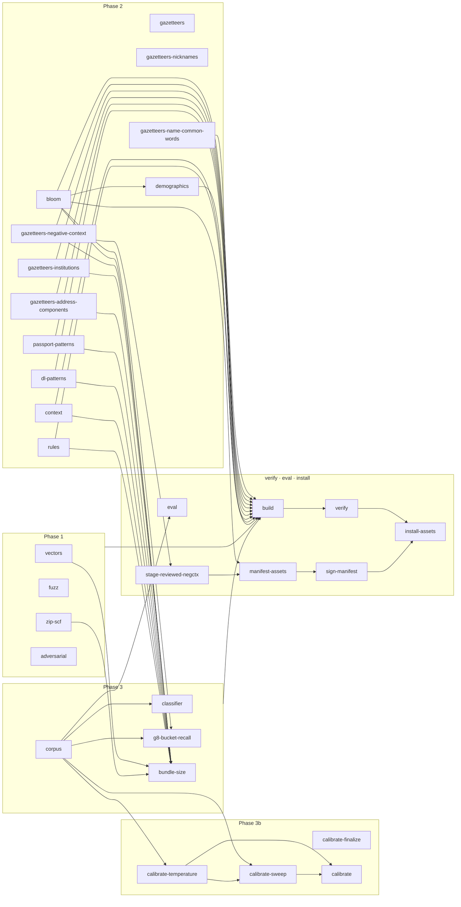

# Resecta Data Pipeline

[](https://github.com/Merlin1A/resecta-datapipeline/actions/workflows/ci.yml)
[](https://github.com/Merlin1A/resecta-datapipeline/actions/workflows/verify.yml)

Build-time Python tooling that produces the detection data shipped inside the [Resecta](https://github.com/Merlin1A/resecta) iOS app (name Bloom filters, gazetteers and pattern tables, classifier assets, the rule catalog) and the engine's test fixtures (test vectors, fuzz payloads, adversarial patterns, the synthetic G8 evaluation corpus).

The pipeline lives in its own repository, apart from the app, for four reasons:

- **Its outputs are data, not code.** The app bundles the detection data as resource files, and its test suite reads the fixtures. Nothing here is linked into the iOS binary and no Python runs on a device.
- **Third-party inputs stay accounted for.** [`SOURCES.md`](./SOURCES.md) records each raw input's license, URL, retrieval date and SHA-256; [`NOTICE.txt`](./NOTICE.txt) carries the attribution.
- **Builds are reproducible.** No builder makes a network call: raw inputs are fetched with `scripts/fetch_*.sh`, a separate step from building. `asset_hashes.lock` pins the SHA-256 of every in-band build artifact, and `make verify` rebuilds them and compares bytes.
- **What reaches the app is signed.** The manifest that lists the installed files is signed with Ed25519 on the maintainer's machine, and the app checks the signature and each file's digest at first load ([`KEY-MANAGEMENT.md`](./KEY-MANAGEMENT.md)).

The pipeline touches the app repository through make targets. `make install-assets` copies built files into the engine's `Resources/` (shipped) and `Tests/…/Fixtures/` (test-only) trees in the sibling `../resecta` checkout (`RESECTA_IOS_ROOT` overrides); its `manifest-assets` step also reads the installed copy under `Resources/` of any routed file this host did not build. `make eval` runs the engine's G8 tests there (with `EVAL_INSTALL_CORPUS=1` it installs the built artifacts first). Some tests also read a sibling checkout at a fixed path when it is present and skip when it is not.

Setup, the checks a change must pass and the changes that need an approved plan: [`CONTRIBUTING.md`](./CONTRIBUTING.md).

---

## Quickstart

```
# One-time setup (Python 3.12; creates .venv/ from the two hash-pinned lockfiles)
scripts/bootstrap.sh

# The pull-request gate's make targets; they work on a clean clone, nothing to fetch
gmake lint typecheck test
gmake vectors fuzz adversarial zip-scf corpus classifier gazetteers context rules
gmake schema-check-only hash-check-built-only

# The full gate: fetch the ParaNames corpus once (about 1 GB), then build
# every artifact into build/ and verify
scripts/fetch_paranames.sh
gmake paranames-shards
gmake build verify

# Remove build/ (the committed files under build/ go too; `git checkout -- build` restores them)
gmake clean

# Maintainer only: both need the sibling ../resecta checkout and the signing key
gmake install-assets     # verify → stage the reviewed file → manifest → sign → copy into the engine tree
gmake all                # build + verify + install-assets
```

Python 3.12 is required. The bootstrap script creates a local venv at `.venv/`, installs pinned dependencies from `requirements.lock` and `requirements-dev.lock`, and installs this package in editable mode. On macOS, install GNU Make 4.x (`brew install make`) and invoke every target as `gmake` — the Makefile refuses its build, verify and install targets under stock `/usr/bin/make` (3.81).

---

## Layout

```
resecta-datapipeline/
├── Makefile                 every build target (`make help` lists them; the block below is generated from it)
├── pyproject.toml           dependency ranges, tool configs
├── requirements.lock        pip-compile output, runtime dependencies
├── requirements-dev.lock    pip-compile output, runtime + dev tools
├── uv.lock                  uv's lock of the same set; CI checks it is current, nothing installs from it
├── asset_hashes.lock        sha256 of every in-band `make build` artifact
├── SOURCES.md               third-party raw inputs: license, URL, retrieval date, SHA-256
├── NOTICE.txt               third-party attribution, hand-maintained; the app repo's root NOTICE mirrors it
├── CHANGELOG.md             release notes
├── CONTRIBUTING.md          setup, checks, invariants, the changes that need a written plan
├── CODE_OF_CONDUCT.md       community standards
├── SECURITY.md              vulnerability disclosure, supply-chain posture
├── KEY-MANAGEMENT.md        the manifest-signing key: what it proves, custody, rotation
├── LICENSE                  the license text
├── .github/                 dependabot config; workflows ci (the PR gate), verify (weekly full verify), security (dependency audit)
├── schemas/                 JSON Schema for the JSON outputs
├── scripts/
│   ├── bootstrap.sh         first-time setup
│   ├── freeze_deps.sh       regenerate both pip lockfiles
│   ├── ci_verify.sh         the weekly verify sequence, run serially
│   ├── check_no_pii.py      pre-public guard against personal e-mail addresses
│   ├── hygiene_gate.py      planning-identifier gate (allowlist: hygiene_allowlist.txt)
│   ├── etl_graph.py         regenerates the README stage map from the make database
│   ├── readme_targets.py    regenerates the README targets block from `make help`
│   ├── fetch_*.sh           per-dataset fetchers, run by hand (see CONTRIBUTING, "Fetching sources")
│   ├── shard_paranames.py   pre-shards the ParaNames corpus for parallel ingest (+ write_shard_meta.py)
│   └── …                    _fetch_lib.sh (+ its README), reap_orphan_workers.py, probe_temperature_convexity.py
├── src/resecta_data/
│   ├── cli.py               the click groups + one register call per command module
│   ├── commands/            the click commands, one module per command family
│   ├── routes.py            the INSTALL_ROUTES / SCHEMA_ROUTES / SHRINK_GUARDED_ROUTES tables
│   ├── manifest_signing.py  Ed25519 signing of the shipped gazetteer manifest
│   ├── common/              io, schema validation, determinism, licensing, mechanism language, stamp keys, exceptions, …
│   ├── vectors/             structural test vectors per PII family
│   ├── fuzz/                ReDoS payload generator; on-demand damaged-PDF fixtures
│   ├── adversarial/         adversarial pattern fixtures
│   ├── bloom/               name Bloom filter builder + manifest
│   ├── gazetteers/          negative/positive context, institutions, address components, ZIP→SCF, passport / DL patterns, common words, nicknames
│   ├── context/             raw sources for the positive context keywords (built by gazetteers/context_keywords/)
│   ├── rules/               PII detector rule-ID catalog
│   ├── demographics/        demographic coverage report; the G8 bucket-stratified recall artifact
│   ├── classifier/          doctype keywords, temperature fit, threshold sweep, context scorer
│   ├── corpus/              G8 synthetic corpus generator + generator profiles
│   ├── instrumentation/     bundle-size probe
│   └── eval/                the G8 eval derivations — see eval/README.md
├── tests/                   pytest suite: unit, determinism, schema and Hypothesis property tests
└── build/                   generated artifacts (git-ignored except a few committed calibration and scorer files)
```

---

## Makefile targets

The block below is `make help`'s output, generated from the Makefile's own `## ` comments; `make readme-targets` regenerates it and `make lint` fails when it is stale. On macOS invoke every target as `gmake`.

<!-- make-help:begin -->
```text
Resecta DataPipeline — build targets

Primary targets:
  help                 Print this help
  check-python         Verify host + venv Python is 3.12
  bootstrap            Create venv and install pinned deps
  check-make           Fail with install advice when GNU make is older than 4.0 (the parse-time guard's twin)
  paranames-shards     Pre-shard paranames_full.tsv.gz so `bloom` can parallelize ingest
  build                Generate all artifacts into build/
  build-fast           Alias — `build` is parallel by default now (BUILD_JOBS=N to override; RAM-capped, see BUILD_JOBS)
  time-build           Run each build phase with per-phase wall-time logging
  vectors              [Phase 1] Build the structural test vectors (one file per vector family)
  fuzz                 [Phase 1] Build ReDoS fuzz payloads
  zip-scf              [Phase 1] Build ZIP → SCF → state table (Census ZCTA if present, else HUD bootstrap)
  adversarial          [Phase 1] Build adversarial pattern fixtures
  bloom                [Phase 2] Build name Bloom filters + manifest
  gazetteers           [Phase 2] Build the non-Bloom gazetteers in parallel
  gazetteers-negative-context [Phase 2] Build negative-context candidates
  stage-reviewed-negctx Stage the reviewed negative_context.json into build/ (verifies the candidates-hash sidecar; safe to re-run)
  gazetteers-institutions [Phase 2] Build institutions gazetteer
  gazetteers-address-components [Phase 2] Build address-components gazetteer
  gazetteers-nicknames [Phase 2] Build nickname/diminutive sidecar (needs its fetched source)
  gazetteers-name-common-words [Phase 2] Build the common-word curation sidecar for the surname Bloom filter
  passport-patterns    [Phase 2] Build per-country passport-pattern gazetteer
  dl-patterns          [Phase 2] Build per-state driver-license-pattern gazetteer
  context              [Phase 2] Build per-category positive context-keyword gazetteer
  rules                [Phase 2] Build PII detector rule-ID catalog
  demographics         [Phase 2] Build demographic coverage report
  classifier           [Phase 3] Build doctype keywords, preset-threshold candidates, and the context scorer
  corpus               [Phase 3] Build the G8 synthetic corpus (+ the generator profiles)
  g8-bucket-recall     [Phase 3] Build the G8 bucket-stratified recall artifact
  bundle-size          [Phase 3] Build the bundle-size instrumentation probe
  calibrate-temperature [Phase 3b] Fit doctype-softmax temperature against a Swift dump
  calibrate-sweep      [Phase 3b] Sweep per-category thresholds against a Swift dump (re-runs the temperature fit; writes the sweep_raw inspection file, never the shipping thresholds)
  calibrate-finalize   [Phase 3b] Promote sweep_raw to the shipping preset_thresholds.json (under an approved change plan: review the diff first)
  calibrate            [Phase 3b] Run both calibration steps (requires Swift-side dumps; finalize is a separate step under an approved change plan)
  sources              Print fetch commands for the main raw inputs (fetching is manual)
  lint                 Run ruff check + format check, the planning-id gate, and the README block currency checks
  security-check       Audit both hash-pinned lockfiles with pip-audit (the security.yml leg, run locally)
  format               Apply ruff formatting and auto-fixes
  graph                Regenerate the ETL stage map in README.md from the make database (Mermaid; stdlib)
  readme-targets       Regenerate the Makefile-targets block in README.md from the help output
  typecheck            Run mypy --strict
  test                 Run pytest
  test-fast            Run pytest excluding slow tests
  schema-check-only    Validate the existing build/ artifacts against their schemas (no rebuild)
  schema-check         Validate every build/ artifact against its schema
  determinism-check    Rebuild artifacts and diff (cached via .stamps/.determinism-witness; RESECTA_FORCE_DETERMINISM=1 to bypass)
  determinism-check-force Determinism check with the witness cache bypassed (rebuild and diff every artifact)
  hash-check-only      Verify asset_hashes.lock against the existing build/ (no rebuild)
  hash-check-built-only Verify asset_hashes.lock against the files present in build/; lock rows with no built file are skipped
  hash-check           Verify asset_hashes.lock matches current build
  verify               Full verification suite (single build; parallel checks + parallel determinism-check)
  verify-fast          Dev-loop gate: verify WITHOUT determinism-check — not sufficient before install-assets (that keeps full verify)
  eval                 corpus (EVAL_CORPUS_PROFILE) -> both G8 emitters (host swift test, n=2) -> eval-baseline x2 -> eval-sitegap into EVAL_OUT
  manifest-assets      Derive gazetteer_manifest.shipped.json (bloom manifest + every installed asset's digest)
  sign-manifest        Sign gazetteer_manifest.shipped.json with Ed25519 (writes .sig + .pem peers)
  install-assets       Copy artifacts from build/ into the Swift Resources path (verify → stage-reviewed-negctx → manifest-assets → sign-manifest, then copy)
  doctor               Print environment health summary (read-only)
  doctor-orphans       List stale resecta-data worker processes (read-only)
  reap-orphans         Send SIGTERM, then SIGKILL after 5 s, to detected orphan workers (with confirmation)
  clean                Remove build/, including the committed files under it (git checkout -- build restores them)
  distclean            Remove build/, .venv/, caches
  all                  Build, verify, and install into Swift tree
  freeze               Regenerate both pip lockfiles (then `uv lock`; CI checks uv.lock)
  shell                Launch an interactive Python shell with the package importable

Current phase: 1+2+3 (Phase 3 adds doctype keywords, preset-threshold candidates, G8 corpus).
Phase 3b: 'make calibrate' is out-of-band. It requires Swift-side softmax + detector-score dumps at build/calibration (see schemas/doctype_softmax_dump.schema.json and schemas/detector_score_dump.schema.json).
```
<!-- make-help:end -->

`make all` is `make build verify install-assets` — a maintainer step, since `install-assets` needs the sibling `../resecta` checkout and the signing key. `make eval` measures the engine on the G8 corpus: the corpus, the engine's two G8 emitters run on the host, and one derived baseline per site; `resecta-data build eval-compare` turns two such runs into a before/after verdict. The contract, the four compare clauses and a checked-in sample verdict are in [`src/resecta_data/eval/README.md`](./src/resecta_data/eval/README.md).

---

## ETL stage map

Generated from the make database by `scripts/etl_graph.py` (`make graph`; `make lint` checks it is current): the phase-tagged build targets and the verify / eval / install chain, with an edge wherever one target, or its stamp, is a prerequisite of another. A phase whose every stamped target feeds `build` is drawn as one edge; Phase 2 stays expanded because the nicknames gazetteer joins `build` only when its fetched source is present.

The `[Phase N]` tags are the Makefile's own grouping of the builders: Phase 1 is the structural test vectors, the fuzz payloads, the adversarial fixtures and the ZIP table; Phase 2 the name filters, the gazetteers, the context keywords, the rule catalog and the coverage report; Phase 3 the classifier assets, the corpus, the bucket-recall report and the bundle-size probe; Phase 3b the calibration steps, which start from score dumps produced on the Swift side and run outside `make build`.

<!-- etl-graph:begin -->

```mermaid
graph LR
  subgraph P1["Phase 1"]
    n_vectors["vectors"]
    n_fuzz["fuzz"]
    n_zip_scf["zip-scf"]
    n_adversarial["adversarial"]
  end
  subgraph P2["Phase 2"]
    n_bloom["bloom"]
    n_gazetteers["gazetteers"]
    n_gazetteers_negative_context["gazetteers-negative-context"]
    n_gazetteers_institutions["gazetteers-institutions"]
    n_gazetteers_address_components["gazetteers-address-components"]
    n_gazetteers_nicknames["gazetteers-nicknames"]
    n_gazetteers_name_common_words["gazetteers-name-common-words"]
    n_passport_patterns["passport-patterns"]
    n_dl_patterns["dl-patterns"]
    n_context["context"]
    n_rules["rules"]
    n_demographics["demographics"]
  end
  subgraph P3["Phase 3"]
    n_classifier["classifier"]
    n_corpus["corpus"]
    n_g8_bucket_recall["g8-bucket-recall"]
    n_bundle_size["bundle-size"]
  end
  subgraph P3b["Phase 3b"]
    n_calibrate_temperature["calibrate-temperature"]
    n_calibrate_sweep["calibrate-sweep"]
    n_calibrate_finalize["calibrate-finalize"]
    n_calibrate["calibrate"]
  end
  subgraph CHAIN["verify · eval · install"]
    n_build["build"]
    n_verify["verify"]
    n_eval["eval"]
    n_stage_reviewed_negctx["stage-reviewed-negctx"]
    n_manifest_assets["manifest-assets"]
    n_sign_manifest["sign-manifest"]
    n_install_assets["install-assets"]
  end
  P1 --> n_build
  P3 --> n_build
  n_bloom --> n_demographics
  n_corpus --> n_classifier
  n_bloom --> n_g8_bucket_recall
  n_corpus --> n_g8_bucket_recall
  n_vectors --> n_bundle_size
  n_zip_scf --> n_bundle_size
  n_bloom --> n_bundle_size
  n_gazetteers_negative_context --> n_bundle_size
  n_gazetteers_institutions --> n_bundle_size
  n_gazetteers_address_components --> n_bundle_size
  n_passport_patterns --> n_bundle_size
  n_dl_patterns --> n_bundle_size
  n_context --> n_bundle_size
  n_rules --> n_bundle_size
  n_corpus --> n_calibrate_temperature
  n_corpus --> n_calibrate_sweep
  n_calibrate_temperature --> n_calibrate_sweep
  n_calibrate_temperature --> n_calibrate
  n_calibrate_sweep --> n_calibrate
  n_bloom --> n_build
  n_gazetteers_negative_context --> n_build
  n_gazetteers_institutions --> n_build
  n_gazetteers_address_components --> n_build
  n_passport_patterns --> n_build
  n_dl_patterns --> n_build
  n_gazetteers_name_common_words --> n_build
  n_context --> n_build
  n_rules --> n_build
  n_demographics --> n_build
  n_build --> n_verify
  n_corpus --> n_eval
  n_gazetteers_negative_context --> n_stage_reviewed_negctx
  n_bloom --> n_manifest_assets
  n_stage_reviewed_negctx --> n_manifest_assets
  n_manifest_assets --> n_sign_manifest
  n_verify --> n_install_assets
  n_sign_manifest --> n_install_assets
```
<!-- etl-graph:end -->

---

## The G8 corpus

G8 is the code's name for the pipeline's synthetic evaluation corpus. There is one canonical G8 corpus: 17 PII families over 1,100 synthetic documents (five doctypes × five demographic buckets), built by `make corpus` into `build/corpus/g8_corpus.json` and hashed in `asset_hashes.lock` (the `corpus/g8_corpus.json` row is the digest of record). `make install-assets` copies it into the engine's test fixtures (`Fixtures/corpus/`) through `INSTALL_ROUTES`, so the engine's bundled fixture and the pipeline's build are the same bytes; `make eval` refuses to run when they differ. The generator profiles (`g8-specC`, `g8-specD`, …) re-render the same 1,100 documents along one axis each (specCD and specAGH combine axes), for evaluation only, and are never installed.

---

## ParaNames (fetch-on-demand)

The large ParaNames corpus (`paranames_full.tsv.gz`, about 1 GB) is **not committed**, and the repo uses **no Git-LFS**. `scripts/fetch_paranames.sh` downloads it on demand into `src/resecta_data/gazetteers/sources/paranames/` and checks its SHA-256 against the pinned `SOURCES.md` row. When the full corpus is absent, the Bloom builders degrade to the committed bootstrap sample (`paranames_bootstrap_*.tsv`) so the build still runs; the full corpus is only needed to reproduce the shipped name filters exactly.

> Reproducing the shipped name filters: `gmake verify` hash-checks the built Bloom filters against `asset_hashes.lock`, whose hashes were produced from the full ParaNames corpus. Run `scripts/fetch_paranames.sh` before `gmake verify`. A bare clean-clone `gmake verify` is expected to fail hash-check (bootstrap-only Bloom != full-corpus lock) — this is the no-LFS / fetch-on-demand design, not a regression. The pull-request gate avoids it by building only the targets that need no fetched source and checking them with `hash-check-built-only`, which skips lock rows whose file was not built.

---

## Verification

Three workflow files run on this repository (GitHub's CodeQL default setup runs beside them):

- **Every pull request and push to `main` (`ci.yml`):** `uv lock --check` · the personal-e-mail guard (`scripts/check_no_pii.py`) · `make lint` (ruff check and format, the planning-id gate, the two README-block currency checks) · `make typecheck` · `make test` · the pure-code builders · `make schema-check-only` · `make hash-check-built-only`. No step after the bootstrap fetches anything, and pytest runs with sockets to anything but loopback disabled. Its `gate` job is the required check on `main`.
- **Weekly, and on dispatch (`verify.yml`):** the ParaNames corpus hydrated (its SHA-256 read from `SOURCES.md`; cached between runs), then the full verify sequence with a forced determinism rebuild.
- **Weekly, on every pull request and on every push to `main` (`security.yml`):** pip-audit over both lockfiles, OSV-Scanner and an SPDX SBOM. Results are reported, never gating.

Locally, `gmake verify` is the gate before anything ships: one build, then, in parallel, `make lint`, `mypy`, `pytest`, schema validation, a check of every in-band artifact against `asset_hashes.lock`, and a determinism rebuild that compares the rebuilt bytes with the first build (skipped while its witness shows unchanged inputs; `RESECTA_FORCE_DETERMINISM=1` forces it). `scripts/ci_verify.sh` runs the weekly workflow's sequence locally — serially, with the determinism rebuild forced.

The shipped manifest is signed with an Ed25519 key that lives outside the repository, held age-encrypted on the maintainer's machine and decrypted in memory only while `make sign-manifest` runs; `make doctor` reports the key's state. What the signature proves, the current public-key fingerprint, and the rotation and exposure procedures are in [`KEY-MANAGEMENT.md`](KEY-MANAGEMENT.md).

---

## Property-based testing

Invariants that hold over a whole input space are tested with [Hypothesis](https://hypothesis.readthedocs.io/) rather than a handful of examples — `@given` over the generator's own domain, most with `@settings(deadline=None)` because verify runs are CPU-oversubscribed (the NPI and SSN properties run derandomized with a fixed example count instead):

- `tests/test_checksums.py` — composing any nine-digit prefix with the computed NPI check digit yields CMS-Luhn remainder 0 and every other check digit breaks it; the DEA check digit is a single digit for every six-digit prefix.
- `tests/test_bloom_ingest_aggregation.py` — the per-source aggregation the parallel Bloom ingest folds together yields, for any batch of rows, the same result, source hash and source list as merging the raw row stream.
- `tests/vectors/test_npi.py` — any ten-digit candidate is accepted by the test's statement of the detector contract iff its prefix is 1 or 2 and the CMS Luhn check passes.
- `tests/vectors/test_ssn.py` — any (area, group, serial) triple is classified consistently with the structural rejection rules, through a test-local mirror of the engine's validator.
- `tests/vectors/test_routing_number.py` — for every eight-digit prefix the computed ninth digit zeroes the ABA checksum and every other final digit breaks it; every seeded draw of the generator is nine digits with a valid prefix and checksum.
- `tests/vectors/test_credit_card.py` — for every prefix, PAN length and seed the Luhn completion keeps the prefix, has exactly that many digits and passes Luhn, and the flipped-last-digit decoy always fails it.
- `tests/vectors/test_dea.py` — for every seed the DEA catalog is a pure function of the seed, its valid rows close the checksum and its invalid-checksum rows break it.

---

## Licensing

Provenance: [`SOURCES.md`](./SOURCES.md) — one row per third-party raw file the builders read under `src/resecta_data/**/sources/` (license, retrieval URL, retrieval date, SHA-256). Attribution: [`NOTICE.txt`](./NOTICE.txt), hand-maintained; the app repository's root `NOTICE` mirrors it row for row. License rules: `common/licensing.py`'s `ALLOWLIST` and `FORBIDDEN` sets and its `GATED` map; the datasets deferred on legal review are listed in `SOURCES.md`. No automated check validates the ledger as a whole; it is reviewed by hand.
